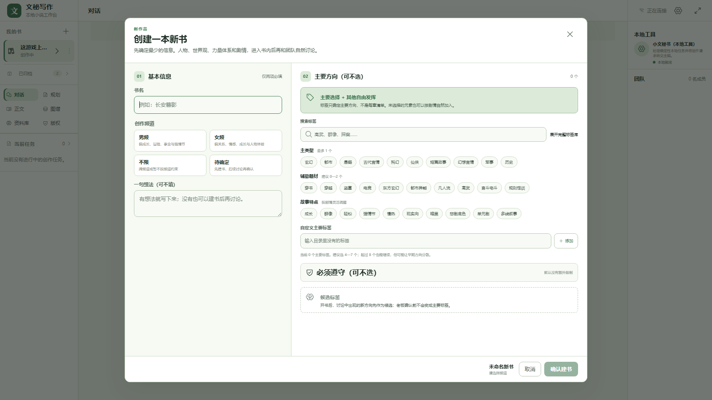

# 开书标签与书架归档 UI 增量证据

- release：`wm-longform-r1-20260719-003435-e4d7b8b7`
- 任务：`UI-20260719-02`
- 决定：`DEC-033`
- 设计审查：`DR-20260719-11`
- 日期：2026-07-19
- 执行者/复核人：当前Codex，未调用其他开发Agent

## 交付范围

- 新建书籍只以书名和频道为界面必填项；一句想法、主要标签、自定义标签和作品额外边界均可留空。
- 男频、女频、不限、待确定使用不同的推荐顺序；完整标签库可以展开和搜索。
- 主要标签固定显示“主要选择 + 其他自由发挥”，总数建议4—7个，超过8个只提示。
- “必须遵守”与主要标签分开，当前选择写入既有定位卡；老板确认界面前不自动启用新的章节硬门禁。
- 活动书与归档书分区；归档先确认、使用真实书籍版本并可恢复；没有永久删除入口。

## 新鲜验证

| 门禁 | 命令 | 结果 |
|---|---|---|
| 设计审计 | `node .agents/skills/wenmi-longform-quality/scripts/validate-audit.mjs docs/ONBOARDING_TAGS_UI_AUDIT.md` | PASS |
| UI目标测试 | `npm test -- tests/integration/experience/workspace-ui.test.tsx` | 1文件、15项通过；含axe弹窗检查 |
| 全量类型/测试/构建 | `npm run verify` | 三工作区类型通过；100文件、214项测试通过；API/Web/Worker构建通过 |
| 生命周期恢复专项 | `npm test -- tests/integration/data-safety/book-lifecycle.test.ts tests/integration/experience/workspace-ui.test.tsx` | 2文件、18项通过 |
| 正式库迁移 | `npm run migrate` | Schema 18，`applied: []`，重复运行安全 |
| 发布验收 | `npm run acceptance` | 提交前功能3/3通过；唯一预期失败为工作树尚未提交，提交后复跑 |
| 实机视觉 | Chrome 1600×900，`http://127.0.0.1:43110/?newBook=1` | 固定一屏、双区滚动、按钮未截断 |

## 故障与修复

首次全量axe检查把弹窗顶端 `<header>` 识别为第二个全局 banner。根因是HTML地标语义，不是颜色或视觉问题。将新增弹窗标题区改为普通 `div.dialog-heading` 后，目标15项与全量214项全部通过。

## 证据边界

- E1：组件、目录、可逆生命周期调用和测试已实现。
- E2：自动测试证明界面约束、无障碍、归档恢复和构建闭环。
- 不声称E3作者可用性盲评或E4长篇文学质量；老板当前视觉反馈仍是下一步调整依据。
- 本增量没有新增Schema、检索或模型上下文改变；软/硬/候选标签的最终运行时治理仍未激活，不得从本证据外推。

## 回滚

代码与文档使用非破坏性revert回滚；任何已归档书籍通过restore恢复。回滚不修改正文、正史或作者资料。

## 截图

